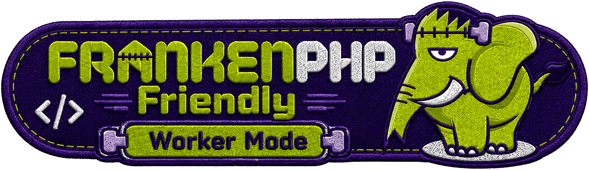

# Cookie Consent Bundle

[](https://github.com/nowo-tech/CookieConsentBundle/actions/workflows/ci.yml) [](https://packagist.org/packages/nowo-tech/cookie-consent-bundle) [](https://packagist.org/packages/nowo-tech/cookie-consent-bundle) [](LICENSE) [](https://php.net) [](https://symfony.com) [](https://github.com/nowo-tech/CookieConsentBundle) [](#tests-and-coverage)

> ⭐ **Found this useful?** [Install from Packagist](https://packagist.org/packages/nowo-tech/cookie-consent-bundle) · Give it a **star** on [GitHub](https://github.com/nowo-tech/CookieConsentBundle) so more developers can find it.

Symfony bundle that renders a GDPR cookie consent modal with category toggles, optional per-cookie selection, cookie inventory, AJAX form submission, optional consent logging, and configurable Doctrine table prefix.
Frontend behavior is implemented in TypeScript and built with Vite (`make assets` → `src/Resources/public/nowo-consent-modal.js`).



This bundle is **FrankenPHP worker mode friendly**.

## Features

- **GDPR modal** — category toggles, optional per-cookie selection, AJAX submit, TypeScript + Vite (`nowo-consent-modal.js`) and standalone CSS (`nowo-cookie-consent.css`, CSP-friendly).
- **Themes** — `ui_theme: bootstrap` (default) or `tailwind`; dual FrankenPHP demos.
- **Cookie inventory** — definitions in YAML and/or Doctrine; optional consent logging with configurable table prefix.
- **Admin UI** — `/cookie-consent-config` (profile, behavior, appearance, modals, route targeting) plus CRUD for cookie definitions.
- **Preferences bubble** — reopen consent after the first choice.
- **Route targeting** — `render_routes` / `skip_render_routes`; helpers `nowo_cookie_consent_should_render()` / `nowo_cookie_consent_render()`.
- **Database config** — `use_database_config` so the admin UI can override YAML at runtime.
- **Cold-start** — cooperates with SiteBackupBundle when the schema is not ready yet.

## Quick start

```bash
composer require nowo-tech/cookie-consent-bundle
```

```yaml
# config/packages/nowo_cookie_consent.yaml
nowo_cookie_consent:
    doctrine:
        table_prefix: 'app_'   # optional; yields app_dashboard_cookie_log
    use_logger: true
```

```twig
{# templates/base.html.twig — preferred: no kernel sub-request #}

    {{ nowo_cookie_consent_render() }}

```

Install public assets:

```bash
php bin/console assets:install
```

## Demo

```bash
make -C demo up-symfony8
# Bootstrap demo: http://localhost:8014

make -C demo up-symfony8-tailwind
# Tailwind demo: http://localhost:8015
```

- `demo/symfony8/` — FrankenPHP Symfony 8 app with Bootstrap 5
- `demo/symfony8-tailwind/` — same demo with Tailwind CSS and `ui_theme: tailwind`

See [Demo with FrankenPHP](docs/DEMO-FRANKENPHP.md) for development vs. production worker mode.

## Documentation

- [Installation](docs/INSTALLATION.md)
- [Configuration](docs/CONFIGURATION.md)
- [PSR evaluation (REQ-CS-007)](docs/PSR.md)
- [Usage](docs/USAGE.md)
- [Contributing](docs/CONTRIBUTING.md)
- [Code of Conduct](CODE_OF_CONDUCT.md)
- [Changelog](docs/CHANGELOG.md)
- [Upgrading](docs/UPGRADING.md)
- [Release](docs/RELEASE.md)
- [Security](docs/SECURITY.md)
- [Engram](docs/ENGRAM.md)
- [Spec-driven development](docs/SPEC-DRIVEN-DEVELOPMENT.md)
- [GitHub Spec Kit](docs/SPEC-KIT.md)

### Additional documentation

- [Demo with FrankenPHP](docs/DEMO-FRANKENPHP.md)
- [GitHub Actions CI requirements](docs/GITHUB_CI.md)

## Tests and coverage

| Language | Lines (approx.) | Command |
| --- | --- | --- |
| PHP | **100%** line coverage on `src/` (run `make coverage-check` to refresh). See [`docs/COVERAGE.md`](docs/COVERAGE.md). | `make coverage-check` |
| TypeScript | ~94% | `make test-ts` |

```bash
make test
make coverage-check
make test-ts
make assets
make release-check
```

PHP coverage target is **≥99%** lines (prefer 100%; see [Release](docs/RELEASE.md) and [`docs/COVERAGE.md`](docs/COVERAGE.md)). TypeScript coverage enforces a minimum of 90% (Vitest thresholds + `.scripts/ts-coverage-percent.sh`).

## License

This bundle is released under the [MIT License](LICENSE).
